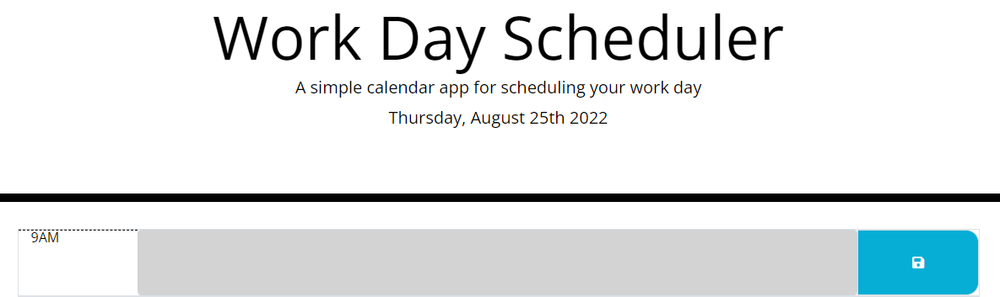

# M.JS-Scheduler

## Description

This webpage help the user keep track of his day to day activities. starting from 9am to 5pm. (standard business hours.)

## Usage

To use this webpage the user must click on one of the nine boxes.
Afterwards, the user will be able to write in the corresponding time box. 
The boxes are color coordinated to help the user keep track of time. 
If the box is grey the time has already past, red represent the present hour, and 
green boxes will show the upcoming hours left.

## Webpage

Deployed Application: https://iinukng.github.io/M.JS--Scheduler/

